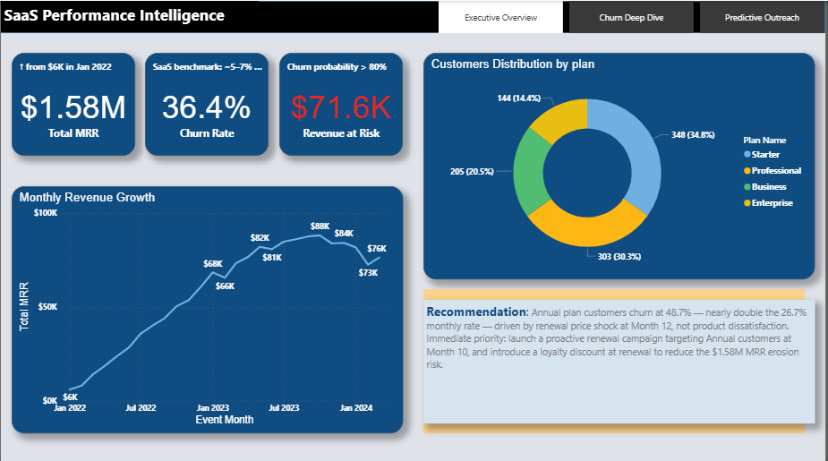
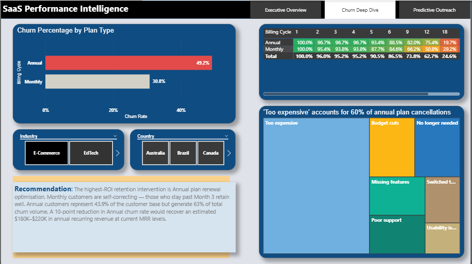
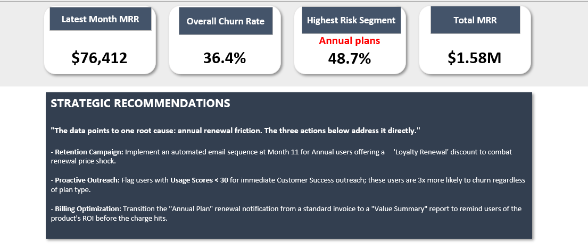
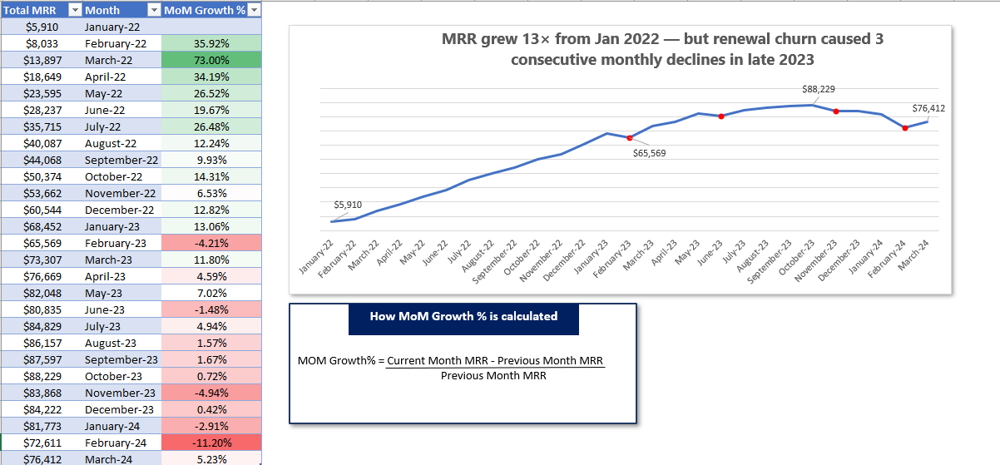

# SaaS Customer Retention & Churn Intelligence System

## Project Summary
End-to-end analytics system built for a simulated SaaS company 
to identify churn drivers, segment customers by risk, and predict 
which active customers are likely to cancel before they do.

**Tools:** SQL · Python (scikit-learn, pandas) · Excel · Power BI  
**Dataset:** 1,000 customers | 14,571 revenue events | 2,405 support tickets  
**Analysis period:** January 2022 – March 2024

---

## The Key Finding — The Annual Plan Paradox

> Annual customers churn at **48.7%** — nearly double the 26.7% rate 
> for monthly customers. Churn peaks at months 12–14 (the renewal window), 
> with "Too expensive" cited by 60% of annual churners.  
> **This is a renewal friction problem, not a product problem.**

---

## Project Structure

| Folder | Contents |
|--------|----------|
| `/data` | Simulated CSV files — customers, revenue events, support tickets |
| `/sql` | 8 production SQL queries |
| `/python` | Logistic regression churn prediction model |
| `/outputs` | Dashboard screenshots, charts, Excel executive report |

---

## SQL Analysis — 8 Queries

| Query | What It Answers |
|-------|----------------|
Churn Rate by Billing Cycle | Proves annual customers churn at 2× the monthly rate |
| Revenue Categorisation | Breaks MRR into event types by month |
| Retention Cohort Analysis | Tracks customer survival from signup month |
| Support Ticket Correlation | Links ticket volume and resolution time to churn |
| At-Risk Customer List | Flags active annual customers with usage score < 30 |
| MRR Trend | Month-by-month revenue growth |
| Billing Cycle Breakdown | Customer count split by plan and churn status |

---

## Python Model Performance

| Metric | Score |
|--------|-------|
| Accuracy | 85.0% |
| Precision | 80.3% |
| Recall | 78.1% |
| AUC-ROC | **0.938** |

Top churn predictors: support ticket volume, usage score, 
billing cycle, and renewal proximity (months 10–14).

---

## Power BI Dashboard — 3 Pages

### Executive Overview

### Churn Deep Dive

### Predictive Outreach

---

## Business Recommendations

1. Launch renewal outreach campaigns at **Month 10** for all 
   annual customers — before the price shock hits
2. Introduce loyalty discounts at renewal to reduce the 
   48.7% annual churn rate
3. Reallocate acquisition budget away from Paid Ads (39.4% churn) 
   toward Direct and Referral channels
4. Automate CS triggers: flag any active customer with usage 
   score below 30 for immediate intervention
5. A 10-point reduction in Annual churn rate would recover 
   an estimated **$180K–$220K** in annual recurring revenue

---

## Excel Executive Report

Four-sheet workbook built for non-technical stakeholders and CFO-level reporting.

### Executive Summary

### MRR Revenue Trends

### Churn Deep Dive

### Predictive Risk List

📥 [Download full Excel workbook](outputs/SaaS_Churn_Executive_Report.xlsx)
